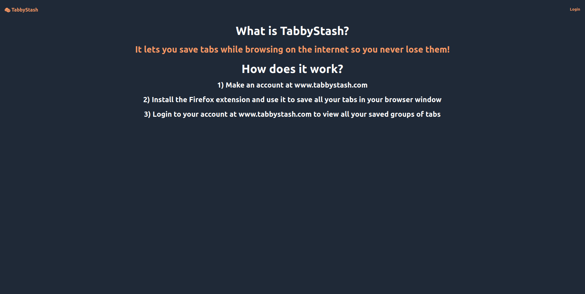

## About The Project

This project was made because I wanted to keep track of an excessive amount of tabs I would have open during programming related tasks. If I was debugging a programming problem and all the tabs in my current browser window were related to that problem, instead of losing that context, I thought it would make more sense to group and store those tabs together to view later. This is where TabbyStash comes in, a web app which integrates with a custom browser extension.

The workflow for using the web app is:
1) Create an account
2) Recieve a verification email to the email you used to make an account
3) Click the link in the verification email to be able to use the web app
4) Once verified, your now able to log into the web app
5) At this point, load the browser extension into Firefox. Click the button of the corresponding browser extension, and when it prompts 'Save tabs', click it. After clicking it, enter a name for the group of tabs in your current browser window. After hitting enter, all the tabs in your current browser window will be saved under the name you provided, to your account in the TabbyStash web app.
6) Log into the web app to view your tab groups. You can filter through tab group names, and also filter through names of tabs in the tab groups.

The tech stack for this project was:
* Frontend: NextJS (React)
* Backend: Flask (Python), Redis, Postgres

Images and gifs of the web app in action:

